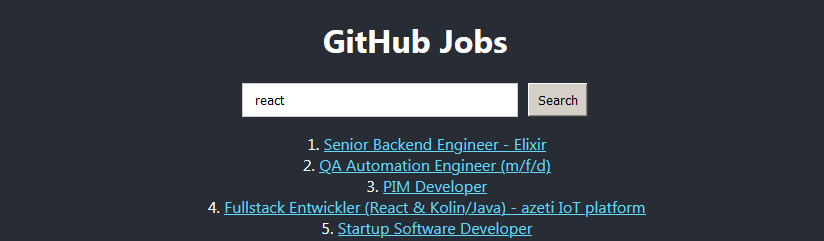

# FEND19 - JavaScript 4 - GitHub Job Listing



## Description

In this task I created a React app that lets the user search for jobs by description. The project is hosted on Firebase and can be visited at this link: [https://dmitrijv-att1.web.app/](https://dmitrijv-att1.web.app/)

Search results from the API are saved in context and any future search will check if the value the user is searching for is already in context, if so, it is returned from context instead of a new network request. After a network request has been initated the search button becomes disabled to prevent spamming search against a slow API.

```js
async function getJobsByDescription(keyword) {
  if (searchCache[keyword]) {
    console.log(`getting cached results for "${keyword}"`);
    setResultList(searchCache[keyword]);
  } else {
    console.log(`making network request for "${keyword}"`);
    setResultList(null);
    setSearchInProgress(true);
    const url = `https://us-central1-wands-2017.cloudfunctions.net/githubjobs?description=${keyword}`;
    fetch(url)
      .then((res) => res.json())
      .then((data) => {
        setResultList(data);
        searchCache[keyword] = data;
        setSearchCache(searchCache);
        setSearchInProgress(false);
      });
  }
}
```

Clicking a job item on the result list will take you to a job details page. A job item is formatted as follows:

```js
<div className="job-container">
  {jobItem && (
    <div>
      <h2>{jobItem.title}</h2>
      <p>
        <strong>{jobItem.type}</strong>
      </p>
      <Image imgUrl={jobItem.company_logo} />
      <a href={jobItem.url}>company url</a>
      <div dangerouslySetInnerHTML={createDescriptionMarkup()} />
    </div>
  )}
  <Link className="App-link" to={"/search"}>
    <p>Back to search</p>
  </Link>
</div>
```

If a user searches for "react javascript", the string is changed to "react+javascript" since the GitHub API expects spaces to be replaced with plus signs.

```js
async function handleJobSearch(event) {
  event.preventDefault();
  if (searchKeyword.length === 0) return;
  const keyword = searchKeyword.replace(" ", "+");
  await getJobsByDescription(keyword);
}
```

## Tests

There is a total of 10 tests to make sure that all of the components in the project are
working as expected. General app test are located in [App.test.js](https://github.com/Dmitrijv/fend19-js4-gitjobs/tree/master/App.test.js) file.
Tests for specific components are located in the [**test**](https://github.com/Dmitrijv/fend19-js4-gitjobs/tree/master/src/components/__test__) folder.

You can run these tests by running the following commands:

```
npm test App.test.js
npm test src/components/__test__/JobList.test.js
npm test src/components/__test__/JobItem.test.js
npm test src/components/__test__/Image.test.js
```
